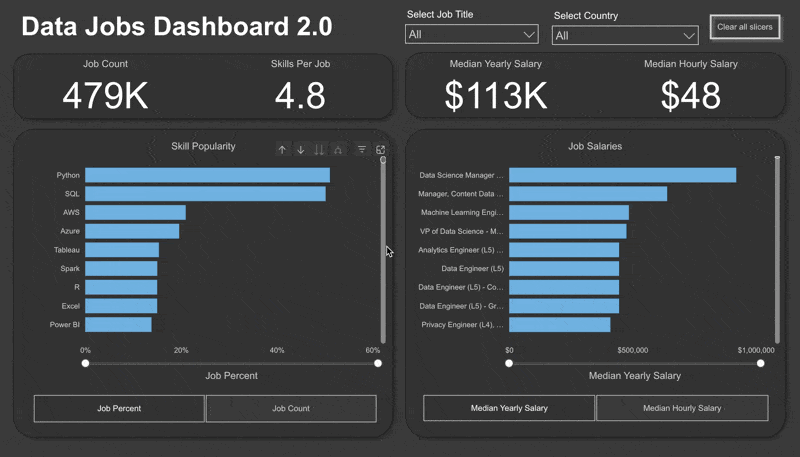

# My Power BI Dashboard Portfolio 📊

Welcome to the Data Den 🐾📊! This repository is where raw numbers transform into actionable, visual storyboards. Whether it's digging through salary metrics or decoding customer behavior, this portfolio tracks my hands-on journey in building interactive, high-impact dashboards.

---

# Featured Dashboards

Explore the dashboards below. Each has its own dedicated README with more details on the build process and specific features.

## 📉 Data Jobs Dashboard (V1 - Comprehensive Exploration)

Designed for job seekers navigating the tech market, this interactive two-page dashboard translates raw compensation and hiring data into strategic career insights. It pairs an executive-level market summary with an analytical drill-through view for granular, job-title-specific trends.

**Key Power BI Skills Utilized:**
* 🎨 Dashboard Layout & Design
* ⚙️ Power Query (ETL & Data Shaping)
* 🔗 Basic Data Modeling (Table Relationships)
* 🧮 Implicit Measures & Standard Aggregations
* 📊 Core Charts (Bar, Line, Area, Column)
* 🗺️ Map Visualizations for Geospatial Data
* 🔢 KPI Cards & Detailed Data Tables
* 🖱️ Interactive Slicers for Filtering
* 🔘 Buttons & Bookmarks for Page Navigation
* ➡️ Drill-Through Functionality

[➡️ **View Full Project 1 Details (README)**](/Data_Jobs_v1/README.md)

---

## 📊 Data Jobs Dashboard 2.0 (V2 - Single-Page Focus)

(./Project2/README.md)

Version 2.0 of the Data Jobs Dashboard streamlines the analysis into a highly focused, single-page experience. It's optimized to deliver the most critical insights quickly to job seekers, featuring dynamic interactions and more advanced analytical capabilities.

**Key Power BI Skills Utilized (demonstrating progression):**
* 🎨 Advanced Dashboard Design (Single-Page UX & Optimization)
* ⚙️ Complex Power Query Transformations
* 🔗 Star Schema Data Modeling Principles
* 🧮 Explicit DAX Measures (e.g., `CALCULATE`, context modifiers)
* 📊 Dynamic Visualizations (driven by Parameters/Slicers)
* ⚙️ Field & Numeric Parameter Implementation for "What-If" Analysis
* 🗺️ Enhanced Geospatial Insights
* 🔢 Advanced Card Visualizations
* 🎚️ Optimized Slicers & Advanced Cross-Filtering Techniques
* ✨ Report Performance Considerations

[➡️ **View Full Project 2 Details (README)**](./Project2/README.md)

---

## About This Portfolio

Each dashboard linked above has its own detailed `README.md` file within its respective project folder. These offer deeper insights into the project objectives, data sources, specific Power BI techniques employed, and a closer look at the dashboard build.